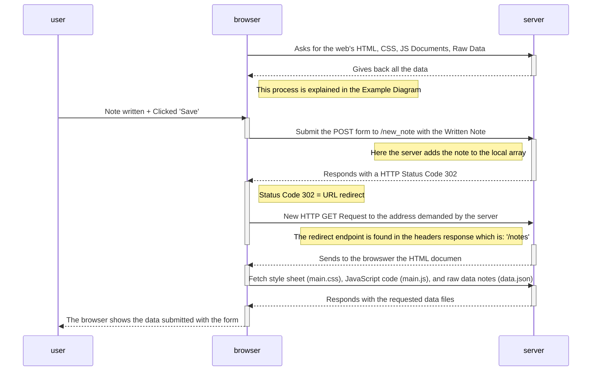

# 0.4: New note diagram

## Exercie requirements

Create a similar diagram depicting the situation where the user creates a new note on the page <https://studies.cs.helsinki.fi/exampleapp/notes> by writing something into the text field and clicking the Save button.

If necessary, show operations on the browser or on the server as comments on the diagram.

The diagram does not have to be a sequence diagram. Any sensible way of presenting the events is fine.

## Solution Proposed

